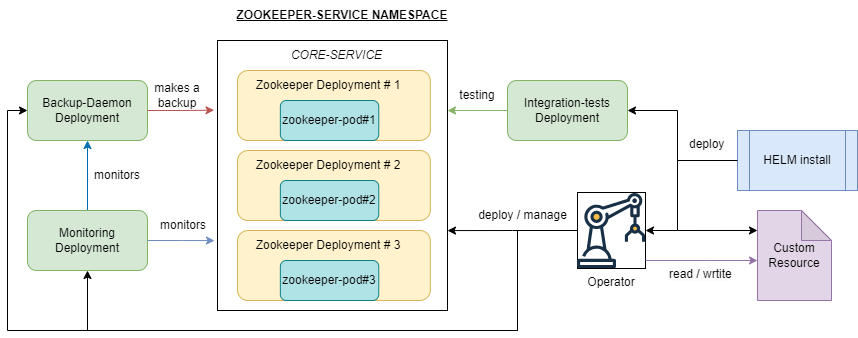
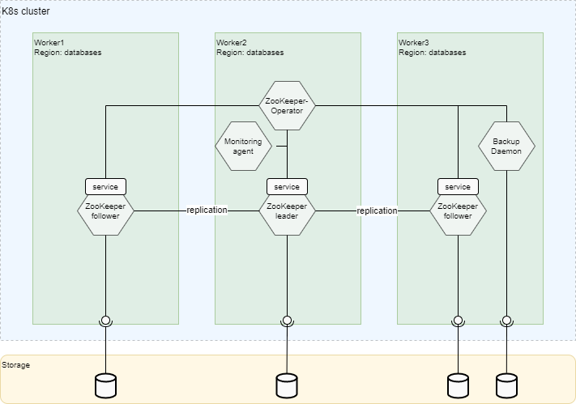

# Overview

[Apache ZooKeeper](https://zookeeper.apache.org/) is a centralized open-source software for managing and coordinating distributed applications.
It provides a hierarchical namespace that allows distributed systems to organize and store data in a reliable and consistent manner.

ZooKeeper ensures high availability and fault tolerance by using a replicated architecture, where multiple servers synchronize their data and provide a unified view to clients.
It is commonly used for tasks such as distributed coordination, leader election, configuration management, and synchronization in distributed systems.

**NOTE:** It is not recommended to use ZooKeeper for new projects and products,
[HashiCorp Consul](https://github.com/Netcracker/qubership-consul/blob/main/README.md) is more preferred choice.
The rarity of releases of ZooKeeper versions, occurring only once a year, makes it inadequate for quickly remediating potential vulnerability issues.
Currently, in the company, Kafka and Config Server are the main users of ZooKeeper.
However, Kafka is moving to a self-managed KRaft cluster, eliminating the dependency on ZooKeeper, while Config Server uses Consul in recent releases as a replacement.

## Qubership ZooKeeper Delivery and Features

The Qubership platform provides ZooKeeper deployment to Kubernetes/OpenShift using the own helm chart with operator and additional features.
The deployment procedure and additional features include the following:

* Support of Qubership deployment jobs for HA scheme and different configurations. For more detailed information, refer to [Installation Guide](/docs/public/installation.md).
* Backup and restore. For more detailed information, refer to [ZooKeeper Backup Daemon Guide](https://github.com/Netcracker/qubership-zookeeper-backup-daemon/blob/main/documentation/maintenance-guide/development-guide/README.md).
* Monitoring integration with Grafana Dashboard and Prometheus Alerts. For more detailed information, refer to [Monitoring Guide](/docs/public/monitoring.md).

# ZooKeeper Components

## ZooKeeper Operator

The ZooKeeper Operator is a microservice designed specifically for Kubernetes environments.
It simplifies the deployment and management of ZooKeeper clusters, which are critical for distributed coordination.
In addition to deploying the ZooKeeper cluster, the operator also takes care of managing supplementary services, ensuring seamless integration and efficient resource utilization.
With the ZooKeeper Operator, administrators can easily maintain and scale their ZooKeeper infrastructure,
focusing on other important aspects of their applications without worrying about the intricacies of cluster management.

## ZooKeeper

The ZooKeeper is custom distribution of original Apache ZooKeeper adapted for cloud environment, offering additional features and tools for enhanced functionality and management.
This container includes SASL authentication, providing secure access control to ZooKeeper clusters.
It also incorporates logging capabilities to capture and analyze important system events.
Moreover, the container includes a Prometheus exporter, enabling seamless integration with monitoring systems for real-time metrics collection.
Additionally, it incorporates health check functionalities and other tools, streamlining the monitoring and maintenance of ZooKeeper clusters.
With this enhanced Docker container, users can effortlessly deploy and manage robust and secure ZooKeeper environments with comprehensive tooling support.

## ZooKeeper Backup Daemon

The ZooKeeper Backup Daemon is a microservice that offers a convenient REST API for performing backups and restores of ZooKeeper data.
It enables users to initiate backups and restores programmatically, making it easier to automate these processes.
Additionally, the daemon allows users to schedule regular backups, ensuring data protection and disaster recovery.
Furthermore, it offers the capability to store backups on remote S3 storage, providing a secure and scalable solution for long-term data retention.
With the ZooKeeper Backup Daemon, administrators can effortlessly manage their ZooKeeper backups and ensure the availability of critical data.

## ZooKeeper Monitoring

The ZooKeeper Monitoring microservice is built on the Telegraf framework, specializing in collecting and analyzing metrics from ZooKeeper.
It seamlessly integrates with ZooKeeper clusters, capturing essential data points for performance monitoring and analysis.
Additionally, the microservice provides a Grafana dashboard, offering a comprehensive visualization of ZooKeeper metrics for better insights and diagnostics.
It also includes an alerting system to promptly notify administrators of any potential issues or anomalies detected within the ZooKeeper environment.
With ZooKeeper Monitoring, users can effectively monitor the health and performance of their ZooKeeper clusters, enabling proactive management and maintenance.

# Supported deployment schemes

## On-Prem

### HA Deployment Scheme

Following the above pictures, let us describe the main parts of the ZooKeeper K8s deployment:

* The minimal number of replicas for HA scheme of ZooKeeper is 3.
* ZooKeeper pods are distributed through Kubernetes nodes and availability zones based on affinity policy during deployment.
* Each ZooKeeper pod has its own Persistent Volume storage.
* In addition to ZooKeeper main storage the ZooKeeper Backup Daemon pod has its own Persistent Volume for backups.
* ZooKeeper Monitoring pod is deployed near ZooKeeper cluster and collects corresponding metrics.
* All components are deployed by ZooKeeper Operator. ZooKeeper Operator itself is deployed by Helm.

### Non-HA Deployment Scheme

For a non-HA deployment scheme, it is possible to use one pod of ZooKeeper cluster.

### DR Deployment Scheme

Not Applicable: two independent ZooKeeper clusters are used.

## Integration With Managed Services

Not Applicable: default HA scheme is used for deployment to managed clouds.
